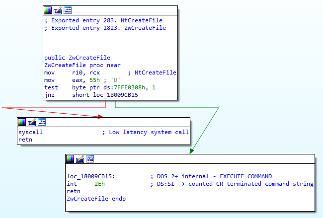

# Syscall Dumper

This is an implementation of a simple (less than 100 lines) C++ program which dumps system call information from `ntdll.dll`.

---

`ntdll.dll` is the interface through which user-mode applications access the Windows kernel. `ntdll.dll` exports functions for every fundamental activity requring access to the domain of the kernel. Examples include interacting with the filesystem, virtual memory, physical devices, and more.

These functions are are esentially thin wrappers for passing information to the kernel for execution. With each syscall, `ntddl.dll` sets up the information that the kernel needs, including placing the relevant _number_ of the system call into register `eax`. Following this, control is diverted to the kernel using the `syscall` instruction. A more complete descriptin of this function can be found [here](https://www.felixcloutier.com/x86/syscall).

The following image shows an example of the disassembly of a Windows sytem call:



`ntdll.dll` itself exports over 2000 functions. On Windows 1909, 464 of `system calls`. The exports of a given executable can quickly be dumped using `dumpbin.exe` as follows:

```
C:\>dumpbin /exports C:\Windows\System32\ntdll.dll
Microsoft (R) COFF/PE Dumper Version 14.24.28316.0
Copyright (C) Microsoft Corporation.  All rights reserved.


Dump of file C:\Windows\System32\ntdll.dll

File Type: DLL

  Section contains the following exports for ntdll.dll

    00000000 characteristics
     C1BB301 time date stamp
        0.00 version
           8 ordinal base
        2381 number of functions
        2380 number of names

    ordinal hint RVA      name

          9    0 0000C4D0 A_SHAFinal
... (truncated)
       2388  94B 00092220 wcstoul
          8      0007C8C0 [NONAME]

  Summary

        1000 .00cfg
        C000 .data
        4000 .mrdata
        F000 .pdata
       47000 .rdata
        1000 .reloc
       70000 .rsrc
      116000 .text
        1000 RT
```

For almost any legitimate, day-to-day activities, a programmer will not interact with `ntdll.dll` directly, but instead will interact with other layers of wrappers around these fundamental system call functions as defined in libraries and subsystem APIs. But for research, malware, and anti-malware purposes, more precise details about the system call numbers are sometimes needed.

## Extracting System Call Numbers From `ntdll.dl`

`ntdll.dll